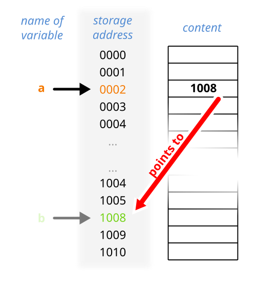

# Pointers

When you create a variable, its value will be stored somewhere into memory. That location is called a memory address. A pointer is a variable that stores such an address, its value is another address. This visualization might be handy:

[](https://en.wikipedia.org/wiki/Pointer_%28computer_programming%29)

Here `a` is a pointer, which points to the address associated with the variable `b`. `b` is the thing pointed to, often referred to as the pointee.

Since pointers can be hard to understand for new programmers and to illustrate why you would want to use them, here is a small analogy heavily inspired by [this comment on reddit](https://www.reddit.com/r/learnprogramming/comments/c1otgq/comment/erflwmp/):

> You have a house.
>
> When you’re outside, and you want to go home, you don’t make another house right where you are, because it’s components are too big for you to carry around and rebuilding it would take a long time.
>
> Instead you carry a piece of paper or store on your phone the address of your house. Now you always know exactly how to find your house so that you can go home.
>
> The piece of paper or your phone is a variable. The variable contains an address (a reference) to your house, which makes it a pointer.
>
> You can make a copy of this piece of paper and hand it out to your friends when you invite them over, instead of building each friend a copy of your house.

This makes pointers especially useful for sharing data without copying it, which is inefficient because it takes more time and space.

## Creating Pointers

Here is how you would create a pointer:

```ts
let x: int = 12
let pX: *int = &x;
```

Let's discuss what this code does. First from the section on variables you should know that the name `x` is associated with the value 12. For this the value 12 is stored at some memory address. Now on to the next line: Here the variable is called `pX` (it's common for pointers to be prefixed with a p in their name). The type is `*int` or pointer to int. Finally, the ampersand is known as the "address of"-operator, it gets the memory address of the variable x. So to sum up we create an integer variable named `x` and store the value 12 into it, after that we create the pointer named `pX` and store the address of the variable x into it.

!!! note
    You can not say `let pX: *int = &12` directly, as 12 is just a value the compiler uses directly. Since it isn’t stored in a variable, it doesn’t have a stable place in memory, so you can’t take its address with `&`.

## Dereferencing Pointers

Since a pointer is a reference to some kind of value, dereferencing a pointer means obtaining that value. Continuing from the example above, this can be achieved by adding an asterisk after the variable:

```ts
print(pX*) // prints 12
```

Through this we can also change the value of a variable:

```ts
pX* = 5
print(x) // prints 5
```

## Mutability of Pointers

Above we saw that we can change the value of variable indirectly through a pointer. What happens when we try the same with a constant? In the section on variables we said that constants are equivalent to immutable variables, so this should not work. And indeed we get an error:

```ts
const PI: float = 3.14159265358
let ptr = &PI;
ptr* = 3 // error: The pointer points to constant data
```

Pointers can actually contain information whether the pointee should be treated as a constant. This is included in the type signature. When taking the address of a constant this happens automatically, but we can make it explicit like this:

```ts
const PI: float = 3.14159265358
let ptr: *const float = &PI
ptr* = 3 // error: The pointer points to constant data
```

Essentially the type signature says: "ptr is a pointer to a constant float". Even if the variable is not a constant, we can write the pointer this way to guarantee that the variable is not changed through the pointer:

```ts
let y = 100
let pY: *const int = &y
pY* = 200 // this is illegal with the same error: The pointer points to constant data
```

!!! note
    A `*const T` does not necessarily say that the `T` being pointed to is immutable or constant! It's simply that this pointer does not have permission to change it, not that nobody has permission. Other pointers (`*T`) may still modify it, or it could be modified directly (if the variable isn't `const` itself).

In all of the examples above the pointer itself is denoted with let, this means we can change what the pointer should point to:

```ts
let x = 12
let y = 100
let ptr: *const int = &x
print(ptr*) // prints 12
ptr = &y // this is allowed, the pointer itself is not const
print(ptr*) // prints 100
ptr* = 200 // this still errors because we said the pointee should be immutable
```

We can also do it the other way around:

```ts
let x = 12
let y = 100
const ptr: *int = &x
print(ptr*) // prints 12
ptr = &y // this is illegal, the pointer is constant
ptr* = 3 // this is allowed however since the pointee is not immutable
print(ptr*) // prints 3; x also holds this value
```

## Nested pointers

You can nest pointers, meaning you can have a pointer to another pointer:

```ts
let x: int = 12
let pX: *int = &x
let ptrPX: **int = &pX
```

Of course constness can be included as well:

```ts
let x: int = 12
const pX: *int = &x
let ptrPX: *const *int = &pX
```

Babels style of denoting pointers, lets you read them conveniently from left to right: ptrPX is a pointer to a constant pointer to a (mutable) integer.

## Pointer Safety

When working with pointers it's essential that they point to valid data. Babel avoids many of the common problems that occur in languages like C. For example, there are:
- no null pointers -- a pointer always points to something
- no uninitialized pointers -- you must give a pointer a value when you create it

These rules already prevent a lot of bugs.

### Dangling pointers

A dangling pointer is a pointer that does not point to a valid object and consequently may make a program crash or behave oddly. A general rule to avoid dangling pointers, is that a pointer should never outlive the data it points to. If the pointee goes out of scope or is destroyed, any pointer referring to it becomes invalid.

To introduce basic memory management and to showcase how a dangling pointer may be obtained, take this example:

```ts
const ptr: *int = malloc(4)
free(ptr) // ptr is now a dangling pointer

ptr* = 10 // very dangerous!
```

In the example above `malloc` is used to get memory, essentially you are asking the computer to designate you some space where you can store data. In this case we requested 4 bytes, so we can store an `int`. The `free` acts as a reverse to `malloc`, once we are done (maybe after some calculations) with the data, we tell the computer: "you can have this memory back now". Using this pointer afterwards does not make sense, since the data it points to does not belong to us anymore -- another program might use this memory. Doing so is very dangerous and a critical security vulnerability since an attacker could write his own code to that memory.

!!! note
    Calling `malloc` gives you a valid pointer, but the memory it refers to is uninitialized. Reading from it before writing is undefined behavior.
